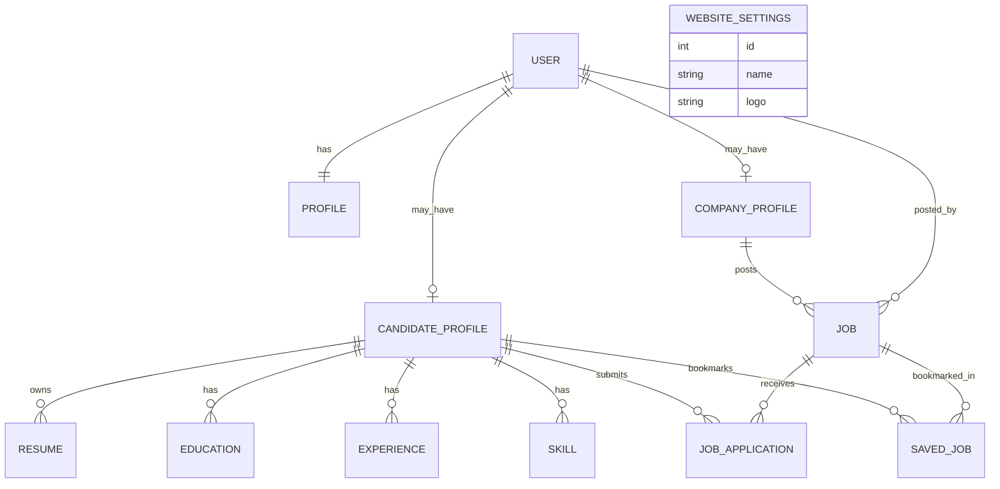
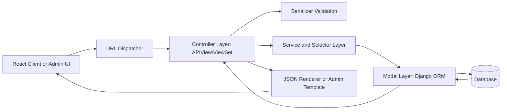
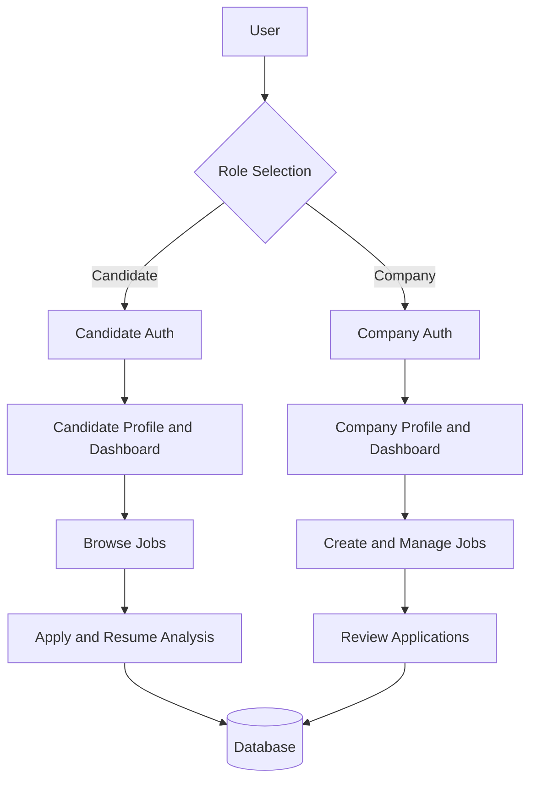

# JobSarathi Project Documentation (MVC-Oriented)

## Documentation Basis
This report is generated from analysis of the actual JobSarathi codebase, including the backend modules under backend/core, backend/user, backend/company, backend/AdminPanal, and backend/backend. The analysis is based on implemented models, serializers, views, URL routing, services, permissions, admin configurations, and settings.

## 1. Project Overview
JobSarathi is a role-based job portal platform designed to connect job candidates and company employers through a secure API-driven architecture. The system separates candidate and company concerns at the domain, authorization, and endpoint levels, while keeping shared identity and profile management centralized.

The backend is implemented with Django and Django REST Framework, and exposes APIs for authentication, profile management, job publishing, application processing, and dashboard statistics. The frontend is delivered as a separate React application, while operational administration is handled through Django Admin enhanced with Jazzmin.

Core objectives achieved by the system include:
- Strict separation of candidate and company workflows.
- Secure authentication with JWT token flow and role checks.
- Structured domain modeling for jobs, applications, profiles, and resumes.
- API-first design to support modern frontend clients.
- Administrative governance through a customized admin panel.

## 2. System Architecture
### 2.1 Architectural Style
The system follows a layered architecture aligned with MVC principles adapted to Django's MVT implementation:
- Data layer: Django ORM models define entities and relationships.
- Application layer: DRF APIView and ViewSet classes orchestrate requests and business rules.
- Domain service layer: services.py, selectors.py, and validators.py encapsulate reusable business logic and query strategies.
- Presentation layer: JSON API responses for React clients, plus Django Admin and built-in template-based admin UI.

### 2.2 Main Backend Modules
- core: authentication, role modeling, profile lifecycle, shared permissions, and RBAC logic.
- user: candidate profile domain, resumes, education, skills, experiences, job applications, and saved jobs.
- company: company profile domain, job posting lifecycle, application review logic, and search/filter services.
- AdminPanal: configurable website branding settings and admin-facing site configuration APIs.
- backend: global settings, middleware, security-oriented configuration, and top-level URL composition.

### 2.3 Request Processing Path
1. Client sends request to URL mapped in backend/backend/urls.py.
2. Django middleware stack handles CORS, security middleware, CSRF/session/auth concerns, and request normalization.
3. DRF view or viewset validates permissions and parses payload.
4. Serializer validates input and maps payload to domain objects.
5. Service/selector layer executes business logic or optimized queries.
6. ORM persists or retrieves data from database.
7. Response is returned as JSON through DRF renderers.

## 3. MVC Mapping in Django (MVT Interpretation)
### 3.1 Why MVC in Django is Expressed as MVT
Django uses Model-Template-View terminology, where:
- Model remains the data/domain layer.
- Template represents presentation (equivalent to MVC View).
- Django View classes/functions coordinate request flow and therefore behave as MVC Controller.

In JobSarathi, this mapping is explicit because the project is API-first:
- Presentation is primarily JSON consumed by React frontend.
- Controller behavior resides in DRF views/viewsets and URL routing.
- Traditional server-rendered templates are mainly represented by Django Admin/Jazzmin interfaces.

### 3.2 Concrete MVC Mapping in This Codebase
| MVC Element | Django/MVT Mapping | JobSarathi Implementation |
|---|---|---|
| Model | Django Models | core.Profile, company.CompanyProfile, company.Job, user.CandidateProfile, user.JobApplication, user.Resume, user.Education, user.Experience, user.Skill, user.SavedJob, AdminPanal.WebsiteSettings |
| View (Presentation) | Templates/Renderers | DRF JSONRenderer/BrowsableAPIRenderer for API output, React frontend as client-side presentation, Django Admin + Jazzmin for management UI |
| Controller | Django Views + URLConf | APIView and ViewSet classes in core/views.py, user/views.py, company/views.py, AdminPanal/views.py; URL dispatch in backend/backend/urls.py and app urls.py files |

### 3.3 Controller Responsibilities in Practice
Controller logic in this project includes:
- Role-specific endpoint access decisions.
- Delegation to serializers for validation.
- Delegation to services for business operations.
- Construction of API response schemas.
- Context-aware behavior (candidate-only and company-only flows).

## 4. Database Design (Models and Relationships)
### 4.1 Core Identity and Role Model
- Django built-in User is the principal identity table.
- core.Profile is a one-to-one extension of User and stores role (candidate/company) plus profile metadata.
- Signals auto-create/synchronize Profile for user lifecycle consistency.

### 4.2 Candidate Domain Model
- CandidateProfile stores personal and professional candidate data.
- CandidateProfile has one-to-many relationships with Resume, Education, Experience, Skill, JobApplication, and SavedJob.
- JobApplication represents candidate-to-job submissions and stores application status, optional resume upload, and analysis metadata.
- SavedJob stores candidate bookmarks for jobs.

### 4.3 Company Domain Model
- CompanyProfile is one-to-one with User for employer account metadata.
- Job stores position information and is linked to posted_by (User) and optionally company (CompanyProfile).
- A Job has one-to-many relation with JobApplication from candidates.

### 4.4 Administration/Configuration Model
- WebsiteSettings in AdminPanal acts as a singleton-style site configuration model for branding fields such as name and logo.

### 4.5 Relationship Summary
- User 1:1 Profile
- User 1:1 CompanyProfile (for employer accounts)
- User 1:1 CandidateProfile (for candidate accounts)
- CompanyProfile 1:N Job
- Job 1:N JobApplication
- CandidateProfile 1:N JobApplication
- CandidateProfile 1:N Resume/Education/Experience/Skill
- CandidateProfile 1:N SavedJob
- Job 1:N SavedJob

### 4.6 Integrity and Performance Considerations
Implemented database controls include:
- Unique application per candidate per job via unique_together(job, candidate) in JobApplication.
- Unique saved job per candidate per job in SavedJob.
- Indexed fields on role, status, job attributes, candidate attributes, and timestamps for efficient filtering and dashboards.
- Domain-specific ordering defaults through abstract timestamp base models.

### 4.7 ER Diagram (Conceptual)

## 5. API and Backend Logic
### 5.1 API Routing Structure
Top-level routing composes the system into:
- /api/ for shared auth/profile endpoints (core).
- /api/candidate/ for candidate operations.
- /api/company/ for company operations.
- Additional alias endpoints for compatibility and frontend convenience.

### 5.2 Authentication and Role Endpoints
Implemented endpoints include:
- Candidate login and registration.
- Company login and registration.
- Login-role discovery endpoint to guide client workflow.
- Legacy login/register endpoints retained for backward compatibility.
- JWT refresh endpoint.

### 5.3 Candidate Module Backend Logic
Key candidate logic includes:
- Candidate profile create/read/update operations.
- Resume, education, experience, and skill management via candidate-owned viewsets.
- Job catalog browse/retrieve with rich query filters and pagination metadata.
- Job application submission with duplicate prevention and resume requirement enforcement.
- Resume keyword matching to compute resume_match_score and analysis narrative.
- Saved jobs CRUD and candidate dashboard aggregation.

### 5.4 Company Module Backend Logic
Key company logic includes:
- Company profile management and update alias endpoint.
- Job CRUD for company-owned postings.
- Job status toggle between Open and Closed.
- Company dashboard statistics endpoint with job and application counts.
- Candidate application listing for posted jobs.
- Application review action with controlled status transitions.

### 5.5 Service/Selector Pattern
The codebase introduces explicit application services to keep controllers lean:
- CandidateService for profile fallback generation, applications, saved jobs, recommendations, and withdrawals.
- JobSearchService for multi-criteria filtering, validation, sorting, and pagination.
- CompanyService and JobManagementService for company-level business operations.
- JobSelector for optimized query composition, annotations, and prefetching.

This structure improves maintainability and testability by separating HTTP concerns from business logic.

## 6. Authentication and Security System
### 6.1 Identity and Login Model
- Authentication uses DRF SimpleJWT with access and refresh tokens.
- Role-aware login serializers validate that users authenticate through the correct role endpoint.
- Role metadata is embedded in token payload for downstream authorization checks.

### 6.2 Password Security and Hashing with Salt
Password handling is implemented securely through Django authentication primitives:
- User passwords are created using user.set_password(...), never stored as plaintext.
- Django automatically applies one-way hashing with per-password random salt.
- With default Django configuration, PBKDF2-based password hashing is used with iterative strengthening.
- Password validators enforce minimum quality constraints (similarity, length, common-password, numeric-password checks).

### 6.3 Authorization and Access Control
- Global DRF default permission is IsAuthenticated.
- Public access is explicitly enabled only where required (job browse, public website settings, selected auth endpoints).
- Role-based permission classes enforce candidate-only and company-only boundaries.
- Ownership checks protect update/delete actions for job resources and profile-scoped entities.

### 6.4 Security Controls in Settings
Implemented protections include:
- SECRET_KEY length guard to avoid weak signing keys.
- JWT lifetime and token rotation configuration.
- Request throttling for anonymous and authenticated users.
- CORS and CSRF trusted origins configuration support.
- File upload size and permission constraints.
- Logging filter to reduce protocol-noise while preserving actionable logs.

## 7. Admin Panel Functionality
### 7.1 Django Admin with Jazzmin
The system uses Django Admin enhanced by Jazzmin:
- Custom branding and navigation ordering.
- Icon mapping for major apps and models.
- Search model configuration for rapid access.
- Enhanced change forms and UI behavior.

### 7.2 Domain Administration
Implemented admin capabilities include:
- CandidateProfile management with inline Resume/Education/Experience/Skill/JobApplication sections.
- Job and CompanyProfile management with structured fieldsets and filters.
- JobApplication moderation actions (mark selected, rejected, under_review).
- Core Profile administration.

### 7.3 Website Settings Governance
AdminPanal supports controlled website branding management:
- Singleton-like WebsiteSettings lifecycle.
- Admin and API checks to prevent uncontrolled multiple settings objects.
- Public read endpoint exposing safe branding fields for frontend rendering.

## 8. Key Features by Module
### 8.1 Candidate Module Features
- Role-protected candidate dashboard endpoint.
- Candidate profile creation/update and normalized full_name/location ingestion.
- Resume upload validation for profile updates.
- Education, experience, skills, and resume CRUD.
- Job discovery with multi-filter search.
- One-click apply flow with duplicate prevention and optional cover letter.
- Resume-to-job keyword matching score and analysis text generation.
- Saved jobs tracking.

### 8.2 Company Module Features
- Company profile onboarding and update endpoints.
- Job posting, editing, deletion, and status toggling.
- Dashboard statistics for operational monitoring.
- Applicant listing restricted to employer-owned jobs.
- Structured applicant review workflow with status transitions and notes.

### 8.3 Cross-Module Features
- Shared role model with backward-compatible fallback logic.
- Common timestamping and index strategies.
- Unified API security baseline.
- Legacy endpoint support to reduce integration breakage.

## 9. Solutions Implemented in the System
The project addresses common job-portal engineering challenges through concrete solutions:

### 9.1 Multi-Role Separation Problem
Solution:
- Distinct candidate/company authentication endpoints.
- Role-aware token serializers.
- Role-based permission classes and endpoint partitioning.

### 9.2 Profile Consistency Problem
Solution:
- Signals auto-create and synchronize core.Profile.
- Service-level fallback creation for CandidateProfile and CompanyProfile.

### 9.3 Duplicate and Invalid Application Problem
Solution:
- Unique constraint on (job, candidate) applications.
- Serializer-level guard for already-applied state and resume requirements.
- Job open-status validation prior to application creation.

### 9.4 Search and Discovery Scalability Problem
Solution:
- JobSearchService with composable filters, strict validation, bounded pagination, and sorting.
- Indexed search-related columns.
- Selector-based query optimization and annotations.

### 9.5 Maintainability and Evolution Problem
Solution:
- Service and selector decomposition for clean separation of concerns.
- Backward-compatible legacy endpoints.
- Alias endpoints to support frontend transition without API contract disruption.

## 10. MVC and System Flow Diagrams (Explanation)
### 10.1 MVC/MVT Request Flow

Interpretation:
- Controller logic is implemented by DRF views and viewsets.
- Model logic is implemented by ORM entities and relations.
- View/presentation is realized by JSON responses to the React frontend and by Django admin template rendering.

### 10.2 Candidate and Company System Flow

## 11. Conclusion
JobSarathi demonstrates a structured and professionally layered implementation of a role-based job portal using Django and DRF. The codebase applies MVC principles through Django's MVT interpretation, where ORM models carry domain state, API views function as controllers, and JSON/admin interfaces provide the presentation layer. The system integrates secure authentication, role-aware authorization, robust data modeling, and modular service-driven backend logic suitable for academic evaluation and practical extensibility.
